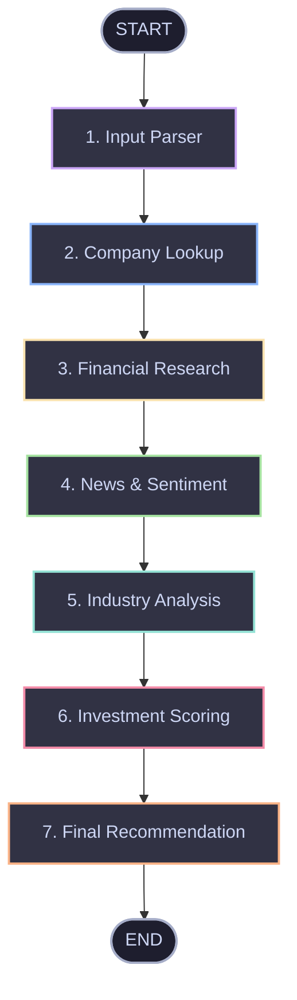

# 📈 Stocky — AI Investment Research Agent

> **Research like an analyst. Decide like an institution.**

Built as part of the **InsideIIM × Altuni AI Labs AI Product Development Engineer Internship Take-Home Assignment** using React, Express, LangGraph, LangChain, OpenRouter, Financial Modeling Prep, and Finnhub.

Stocky is a production-ready AI investment research agent. Rather than acting as a chatbot, it behaves like an equity research assistant: given a company name or ticker, it automatically researches the company, gathers financial data and recent news, performs qualitative analysis using an LLM, calculates deterministic investment scores, and produces a structured investment recommendation with supporting evidence.

---

## 🔗 Live Demo (Placeholders)
* **Frontend:** [https://stocky-client.vercel.app](https://stocky-client.vercel.app)
* **Backend:** [https://stocky-server.railway.app](https://stocky-server.railway.app)

---

## Table of Contents
1. [Motivation & Architectural Philosophy](#1-motivation--architectural-philosophy)
2. [Graph Architecture (LangGraph Node Breakdown)](#2-graph-architecture-langgraph-node-breakdown)
3. [Scoring Rubric & Formulas](#3-scoring-rubric--formulas)
4. [Prompt Engineering Philosophy](#4-prompt-engineering-philosophy)
5. [System Data Flow & Caching](#5-system-data-flow--caching)
6. [Repository Structure](#6-repository-structure)
7. [API Design & Documentation](#7-api-design--documentation)
8. [Challenges & Engineering Mitigations](#8-challenges--engineering-mitigations)
9. [Production Readiness & Deployment Guide](#9-production-readiness--deployment-guide)
10. [Screenshots](#10-screenshots)
11. [AI Usage Report](#11-ai-usage-report)

---

## 1. Motivation & Architectural Philosophy

Traditional financial AI systems suffer from two distinct problems:
1. **Hallucination & Inconsistency:** Generative AI models asked to "score" a company will output arbitrary numbers (e.g. "Growth is 8.5/10") based on token probability rather than financial balance sheets. The reasoning is untraceable and reproduces differently with every seed.
2. **Missing Context:** Pure quantitative models calculate ratios correctly but fail to capture human context, competitive moats, leadership changes, or macro catalysts.

### The Hybrid Solution
Stocky solves this by decoupling **quantitative computation** from **qualitative synthesis**:

```
                       ┌──────────────────────────────┐
                       │   Company Name / Ticker Input │
                       └──────────────┬───────────────┘
                                      │
                                      ▼
                       ┌──────────────────────────────┐
                       │ Real-time Financial API Data │
                       └──────────────┬───────────────┘
                                      │
              ┌───────────────────────┴───────────────────────┐
              ▼                                               ▼
┌───────────────────────────┐                   ┌───────────────────────────┐
│  Deterministic Ratios     │                   │  Structured LLM Analysis  │
│  - Revenue growth formula  │                   │  - Moat strength analysis │
│  - PE multiple analysis    │                   │  - Competitor landscape   │
│  - D/E and Current ratio  │                   │  - Sentiment synthesis    │
└─────────────┬─────────────┘                   └─────────────┬─────────────┘
              │                                               │
              └───────────────────────┬───────────────────────┘
                                      │
                                      ▼
                       ┌──────────────────────────────┐
                       │ Hybrid Scoring & Synthesis   │
                       │ - Deterministic: 60 points   │
                       │ - Qualitative LLM: 40 points  │
                       └──────────────┬───────────────┘
                                      │
                                      ▼
                       ┌──────────────────────────────┐
                       │ Explanatory Report & Verdict │
                       └──────────────────────────────┘
```

* **Deterministic Scoring (60% Weight):** Balance sheets, profitability tracking, and valuation multiples are calculated through strict TypeScript formulas. If a company has negative revenue growth or an inflated P/E ratio, it is penalized deterministically.
* **Qualitative Reasoning (40% Weight):** The LLM evaluates abstract data like competitive advantage (moats), industry growth catalysts, and news sentiment, mapping them onto a strict, normalized rubric.
* **Balanced Synthesis:** The final recommendation (BUY/HOLD/SELL) is mapped strictly from the consolidated 100-point score, ensuring the LLM cannot override mathematical metrics.

---

## 2. Graph Architecture (LangGraph Node Breakdown)

Stocky uses LangGraph to partition the research task into a series of seven discrete, single-purpose nodes. This prevents context contamination, facilitates targeted error handling, and allows each node to read and write from a shared, strongly-typed state context.

### Graph Flow



### Shared State Definition
The orchestrator maintains a single source of truth throughout execution:

```typescript
interface InvestmentState {
  companyName: string;                     // Raw input text
  ticker: string;                          // Resolved capital symbol
  profile: CompanyProfile | null;          // Company profile details
  financials: FinancialMetrics | null;      // Extracted financial ratios
  news: NewsSentiment | null;              // Recent news list & sentiment rating
  industrySummary: string;                 // Text analysis of competitive environment
  businessQuality: {                       // Moat assessment score (LLM-derived)
    score: number;
    reasoning: string;
  } | null;
  riskProfile: {                           // Risk mitigation rating (LLM-derived)
    score: number;
    reasoning: string;
    topRisks: { factor: string; deduction: number }[];
  } | null;
  scores: Scores | null;                   // Final deterministic & hybrid scores
  decision: string;                        // BUY, HOLD, SELL, etc.
  recommendation: Recommendation | null;   // Synthesis text, pros & cons lists
  sources: string[];                       // Source citations
  errors: string[];                        // Graceful recovery logs
  dataStatus: "COMPLETE" | "PARTIAL" | "INSUFFICIENT";
  dataConfidence: number;                  // Data coverage indicator (1-5 stars)
}
```

### Node-by-Node Specifications

1. **Input Parser:** Resolves query text into ticker symbols. Biases towards USD-denominated symbols on major US exchanges to ignore foreign secondary listings.
2. **Company Lookup:** Retrieves description, sector, industry, and logo. Uses FMP with Finnhub fallback.
3. **Financial Research:** Pulls 4 years of income statements and the latest balance sheet. Computes Year-over-Year revenue growth and debt-to-equity leverage.
4. **News & Sentiment:** Gathers recent company news (past 30 days) and runs an LLM step to classify sentiment.
5. **Industry Analysis:** Uses LLM to assess competitive moat, industry outlook, business quality, and risk factors.
6. **Investment Scoring:** Executes the mathematical calculations (detailed in section 3). Checks for missing filings and calculates the data confidence rating.
7. **Final Recommendation:** Synthesizes scores, news, and financials into a coherent investment thesis.

---

## 3. Scoring Rubric & Formulas

The scoring rubric divides the company's performance into 5 categories, totaling a maximum of 100 points.

| Dimension | Max Points | Evaluation Mode | Primary Drivers |
| :--- | :---: | :---: | :--- |
| **Financial Health** | 30 | Deterministic | Revenue trend, net cash position, operating margins, leverage |
| **Growth Potential** | 20 | Deterministic | YoY Revenue growth rate, net profitability trends |
| **Valuation** | 10 | Deterministic | Price-to-Earnings (P/E) multiple, current ratio liquidity |
| **Business Quality** | 20 | Qualitative LLM | Moat strength, management competency, sector dominance |
| **Risk Profile** | 20 | Qualitative LLM | Leverage risks, macroeconomic exposure, news headwinds |

### Scoring Formulas & Rules

#### 1. Financial Health (Max 30 Points)
* **YoY Revenue Growth (Max 8 pts):** 
  * Growth $> 20\%$: $+8$ pts | $10\%\text{--}20\%$: $+6$ pts | $5\%\text{--}10\%$: $+4$ pts | $0\%\text{--}5\%$: $+2$ pts | Negative: $0$ pts.
* **Debt-to-Equity Leverage (Max 6 pts):**
  * D/E Ratio $< 0.5$: $+6$ pts | $0.5\text{--}1.0$: $+4$ pts | $1.0\text{--}2.0$: $+2$ pts | $\ge 2.0$: $0$ pts.
* **Operating Profitability (Max 8 pts):**
  * Margin $> 25\%$: $+8$ pts | $15\%\text{--}25\%$: $+6$ pts | $5\%\text{--}15\%$: $+4$ pts | $< 5\%$: $0$ pts.
* **Cash Reserves (Max 8 pts):**
  * Net Cash Surplus ($\text{Cash} > \text{Debt}$): $+8$ pts | Positive Cash $> 0$: $+5$ pts | Zero cash: $+2$ pts.

#### 2. Growth Potential (Max 20 Points)
* **Revenue Expansion (Max 8 pts):** Evaluated against YoY growth bands (identical to Financial Health scaling).
* **Profitability Check (Max 6 pts):**
  * Both Net Income and EPS are positive: $+6$ pts | Net Income is positive but EPS is unrecorded: $+3$ pts | Unprofitable: $0$ pts.
* **Industry Position Constant (Max 6 pts):** Standard baseline for verified listings: $+6$ pts.

#### 3. Valuation (Max 10 Points)
* **P/E Multiple (Max 6 pts):**
  * P/E ratio $> 0$ and $< 15$: $+6$ pts | $15\text{--}25$: $+4$ pts | $25\text{--}40$: $+2$ pts | $\ge 40$ or Negative: $0$ pts.
* **Liquidity / Current Ratio (Max 4 pts):**
  * Current Ratio $> 1.5$: $+4$ pts | $1.0\text{--}1.5$: $+2$ pts | $< 1.0$: $0$ pts.

#### 4. Business Quality (Max 20 Points) & Risk Profile (Max 20 Points)
* Evaluated qualitatively by the LLM in Node 5 using sector position, moat parameters, and news sentiment.

---

### Decision Mapping
The cumulative score maps to the final investment decision:

$$\text{Final Score} = \text{Financial Health} + \text{Growth} + \text{Valuation} + \text{Business Quality} + \text{Risk Profile}$$

| Cumulative Score | Final Verdict | Dashboard Badge Color |
| :---: | :--- | :---: |
| **80 – 100** | STRONG BUY | Bright Emerald |
| **65 – 79** | BUY | Light Green |
| **50 – 64** | HOLD | Amber Yellow |
| **35 – 49** | SELL | Soft Crimson |
| **0 – 34** | STRONG SELL | Dark Red |

---

## 4. Prompt Engineering Philosophy

Instead of relying on free-form text, Stocky restricts LLM responses to strict, normalized JSON formats. Prompts explicitly enforce key structures, range boundaries, and prevent the generation of ungrounded financial claims.

### Key Node Structures

#### Node 4 (News Sentiment Analysis)
* **Purpose:** Assesses recent news sentiment.
* **Inputs:** Ticker symbol, list of top 5 headlines, source domain, publication date.
* **Output Keys:** `overallSentiment` ("bullish" | "bearish" | "neutral"), `sentimentScore` (float from -1.0 to 1.0), `summary` (string), `keyPositiveCatalysts` (array), `keyRisks` (array).

#### Node 5 (Qualitative Assessment)
* **Purpose:** Evaluates competitive moat and industry trends to compute qualitative scores.
* **Inputs:** Company sector, industry, description, revenue growth, leverage ratios, news sentiment.
* **Output Keys:** `industrySummary` (string), `businessQuality` (`score` 0-20, `reasoning` string), `riskProfile` (`score` 0-20, `reasoning` string, `topRisks` array of factor/deduction objects).

#### Node 7 (Recommendation Synthesis)
* **Purpose:** Combines quantitative scores and qualitative summaries to construct the final investor thesis.
* **Inputs:** Company profile, financials, news sentiment, total deterministic scores, final decision category.
* **Output Keys:** `confidence` (percentage integer between 60 and 95), `thesis` (detailed 2-paragraph string), `pros` (array), `cons` (array), `catalysts` (array), `verdict` (detailed justification string), `shortTermOutlook` (string), `longTermOutlook` (string).

---

## 5. System Data Flow & Caching

Stocky uses a layered caching and retrieval system designed to maximize coverage, respect API rate limits, and run entirely in-memory.

```
       [Client Application]
                 │
                 │ POST /api/analyze
                 ▼
         [API Route Handler] ───────────────► [GET /ping Check]
                 │
                 ▼
       [LangGraph Orchestrator]
                 │
                 ├──► [1. Cache Layer Check (profile/financials)]
                 │         │
                 │         ├──► (Cache Hit) ──► Load state locally
                 │         │
                 │         └──► (Cache Miss) ──► [2. Finnhub Primary API]
                 │                                     │
                 │                                     ├──► (Success) ──► Write Cache
                 │                                     │
                 │                                     └──► (Rate Limit/Fail)
                 │                                              │
                 │                                              ▼
                 │                                    [3. FMP Fallback API]
                 │                                              │
                 │                                              ▼
                 │                                         Write Cache
                 │
                 ▼
       [OpenRouter LLM Synthesis]
                 │
                 ▼
     [Consolidated JSON Response]
```

### Caching Strategy
* **TTL Configuration:** 24-hour default time-to-live (`DEFAULT_TTL`).
* **Cache Key Partitioning:** Keys are prefixed dynamically to isolate metadata from financials:
  * `profile:${symbol}`
  * `financials:${symbol}`
* **Eviction Policy:** Expired entries are evicted lazily upon read requests, preventing memory leaks during continuous execution.

---

## 6. Repository Structure

```text
Stocky/
├── client/                     # Frontend Application (React v19 + Vite + Tailwind v4)
│   ├── src/
│   │   ├── components/         # Reusable presentation components
│   │   │   ├── CompanyHeader.tsx      # Logo, ticker information, confidence indicators
│   │   │   ├── ScoreCard.tsx          # Circular score ring, subscore bars & explanations
│   │   │   ├── RecommendationCard.tsx # Decision badge, rating breakdown, thesis & outlook
│   │   │   ├── FinancialCard.tsx      # Grid displaying fundamental business ratios
│   │   │   ├── NewsCard.tsx           # Recent stories, overall sentiment banner
│   │   │   └── SearchBar.tsx          # Autocomplete search input
│   │   ├── App.tsx                    # Application router & main scrollable view
│   │   ├── index.css                  # Tailwinds directives and custom keyframe animations
│   └── package.json
│
├── server/                     # Backend API (Express + TypeScript + LangGraph)
│   ├── src/
│   │   ├── config.ts           # Strict Zod environment variable validation
│   │   ├── index.ts            # Entrypoint, CORS config, global error handler
│   │   ├── graph/
│   │   │   ├── investmentGraph.ts     # Core LangGraph compilation
│   │   │   └── nodes/                 # 7 execution graph nodes
│   │   ├── routes/
│   │   │   └── investment.ts          # Express handlers, search endpoint
│   │   ├── services/
│   │   │   ├── cache.ts               # In-memory cache layer
│   │   │   ├── finnhubApi.ts          # Finnhub API service layer
│   │   │   ├── fmpApi.ts              # FMP API service layer
│   │   │   └── llm.ts                 # OpenRouter API wrapper & JSON parser
│   │   └── utils/
│   │       ├── logger.ts              # Production logging manager
│   │       ├── scoring.ts             # Deterministic quantitative formulas
│   ├── tsconfig.json
│   └── package.json
```

---

## 7. API Design & Documentation

### 1. Autocomplete Search
* **Endpoint:** `GET /api/search`
* **Query Params:** `q` (search query)
* **Response Payload:** `symbol`, `name`, `exchange` of matching companies.

```json
[
  {
    "symbol": "AAPL",
    "name": "Apple Inc.",
    "exchange": "NASDAQ"
  }
]
```

---

### 2. Run Comprehensive Investment Analysis
* **Endpoint:** `POST /api/analyze`
* **Request Payload:**
```json
{
  "company": "NVIDIA Corporation",
  "ticker": "NVDA"
}
```

* **Success Response (200 OK):**
```json
{
  "success": true,
  "analysis": {
    "company": {
      "name": "NVIDIA Corporation",
      "ticker": "NVDA",
      "exchange": "NASDAQ",
      "industry": "Semiconductors",
      "sector": "Technology",
      "marketCap": 3200000000000,
      "logo": "https://financialmodelingprep.com/images-images/NVDA.png"
    },
    "financials": {
      "currentPrice": 128.2,
      "revenue": 96310000000,
      "revenueGrowth": 1.25,
      "netIncome": 53000000000,
      "peRatio": 60.4,
      "operatingMargin": 0.55,
      "currentRatio": 3.2,
      "debtToEquity": 0.15
    },
    "scores": {
      "financial": 30,
      "financialReasoning": "Strong revenue growth (>20% YoY): +8, Low debt-to-equity leverage (<0.5): +6, Elite operating margin (>25%): +8, Net cash surplus (Cash > Debt): +8",
      "growth": 20,
      "growthReasoning": "Hyper-growth expansion (+8), highly profitable earnings track (+6), resilient industry positioning (+6)",
      "valuation": 4,
      "valuationReasoning": "Highly priced PE multiple (+0), comfortable current ratio (+4)",
      "business": 18,
      "risk": 16,
      "total": 88
    },
    "decision": "STRONG BUY",
    "recommendation": {
      "confidence": 92,
      "thesis": "NVIDIA dominates the enterprise artificial intelligence acceleration market with its proprietary CUDA software moat. Unprecedented revenue growth and low leverage compensate for its high valuation multiple.",
      "pros": [
        "YoY revenue growth exceeding 100%",
        "Operating margins at record 55%"
      ],
      "cons": [
        "High valuation PE multiple exceeding 60x",
        "Geopolitical risks regarding semiconductor supply chains"
      ],
      "verdict": "A quantitative score of 88/100 maps nvda to a STRONG BUY recommendation.",
      "shortTermOutlook": "AI scaling demand remains strong, supporting growth over the next 12 months.",
      "longTermOutlook": "Solid moat from CUDA ecosystem ensures long-term market leadership."
    },
    "sources": [
      "Financial Data: Financial Modeling Prep",
      "Qualitative Research: OpenRouter"
    ],
    "errors": [],
    "dataStatus": "COMPLETE",
    "dataConfidence": 5
  }
}
```

---

### 3. Keep-Alive / Health Ping
* **Endpoint:** `GET /ping`
* **Response Payload:** `"pong"`

---

## 8. Challenges & Engineering Mitigations

### 1. Gemini API Quota Limits
* **Problem:** Direct Gemini API calls hit tight Rate-Per-Minute (RPM) and Rate-Per-Day (RPD) limits on the free tier during concurrent testing.
* **Mitigation:** Migrated the LLM caller layer in `llm.ts` to query OpenRouter using the `google/gemini-2.0-flash-lite:free` endpoint. This provides higher quotas and reliable performance, with a configurable model parameter (`OPENROUTER_MODEL`).

### 2. FMP API Paths Migration
* **Problem:** Traditional path-based endpoints (e.g. `/api/v3/profile/AAPL`) on Financial Modeling Prep returned structure errors or key-invalid messages for certain accounts.
* **Mitigation:** Migrated all FMP service calls to use query parameters on the `/stable` endpoint path, providing consistent data delivery across queries.

### 3. OpenRouter JSON Truncation & Parsing
* **Problem:** Large summaries sometimes triggered truncated JSON streams from the LLM, leading to parse failures during execution.
* **Mitigation:** Refactored the prompting strategy to requests for compact paragraphs, and implemented a robust regex-based extraction utility in `llm.ts` that strips markdown code fences (` ```json `) and isolates raw curly braces `{}` before parsing.

### 4. Ticker Ambiguity
* **Problem:** Company searches for names like "Visa" resolved to Canadian secondary DR listings or alternative exchanges, causing subsequent statement lookups to fail.
* **Mitigation:** Added a weighting algorithm to the search results page in `fmpApi.ts` and `finnhubApi.ts`. The algorithm biases ticker symbols without dot suffixes, USD-denominated values, and US primary exchanges (NASDAQ, NYSE).

---

## 9. Production Readiness & Deployment Guide

### 1. Environment-Aware Logging (`server/src/utils/logger.ts`)
* In development, the terminal displays live details for each graph step to assist debugging.
* In production, the logger silences non-critical output, reporting only critical errors (`logger.error`) to clean up log streams.

### 2. Configurable API Endpoint Base (`client/src/lib/api.ts`)
* When deployed on different hosts, the frontend requests endpoints via the `VITE_API_URL` environment variable.
* If undefined, the client falls back to `/api` paths to support monolith configurations.

---

### Step-by-Step Deployment

#### Backend (Railway or Render)
1. Link your repository.
2. Configure the following environment variables:
   ```env
   NODE_ENV=production
   PORT=8080
   FMP_API_KEY=your_fmp_api_key
   OPENROUTER_API_KEY=your_openrouter_api_key
   ```
3. Set the start script: `npm run build && npm run start`.

#### Frontend (Vercel)
1. Import the `client` directory.
2. Configure the environment variables:
   ```env
   VITE_API_URL=https://your-backend-domain.com
   ```
3. Deploy.

---

## 10. Screenshots

### Search Page
*Place for Search Page screenshot*

### Investment Dashboard
*Place for Investment Dashboard screenshot*

### Score Breakdown
*Place for Score Breakdown screenshot*

### Recommendation
*Place for Recommendation Card screenshot*

### News Analysis
*Place for News & Sentiment screenshot*

---

## 11. AI Usage Report

AI was extensively used during development for architecture exploration, LangGraph workflow design, prompt engineering, debugging, TypeScript implementation assistance, UI refinement, and documentation. Every generated implementation was reviewed, tested, modified, and integrated manually.

---

## License
This project was developed solely for the InsideIIM × Altuni AI Labs AI Product Development Engineer Internship Take-Home Assignment. All rights reserved.
