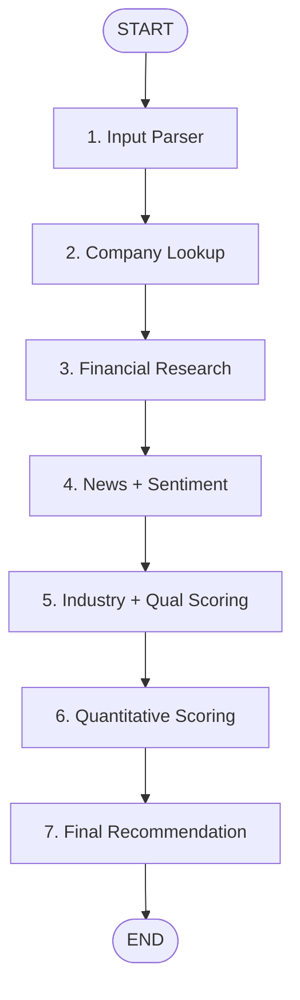

# Stocky — System Architecture

Stocky is an AI-powered Investment Research Agent designed with the philosophy of **factual transparency**. It separates quantitative, verifiable facts (sourced from structured APIs) from qualitative analysis and synthesis (sourced from LLMs).

---

## 1. High-Level Design

```
                  ┌──────────────────────┐
                  │  React 19 Frontend   │
                  │       (Vite)         │
                  └──────────┬───────────┘
                             │
                             │ POST /api/analyze { company: "Apple" }
                             │
                  ┌──────────▼───────────┐
                  │ Express TS Backend   │
                  └──────────┬───────────┘
                             │
                  ┌──────────▼───────────┐
                  │   LangGraph Agent    │
                  └──────────┬───────────┘
                             │
          ┌──────────────────┼──────────────────┐
          ▼                  ▼                  ▼
┌──────────────────┐┌──────────────────┐┌──────────────────┐
│  FMP stable API  ││  GNews stable    ││  OpenRouter API  │
│ (Financial Data) ││  (News Articles) ││  (LLM Synthesis) │
└──────────────────┘└──────────────────┘└──────────────────┘
```

The system is split into three decoupled layers:
1. **Frontend (Client):** A single-page client built with React 19, Tailwind CSS v4, and shadcn/ui. Renders an interactive search landing page and a Bloomberg-terminal-inspired dashboard.
2. **Backend (Server):** An Express REST API written in TypeScript, acting as the wrapper for the LangGraph agent.
3. **AI Layer (Agent):** A 7-node sequential graph built using LangGraph.js that coordinates data fetching and AI synthesis.

---

## 2. LangGraph Pipeline & Data Flow

Stocky models the process of a professional research analyst. Instead of asking a single prompt to output an opinion, it runs a sequential pipeline where each node performs a discrete task and updates a shared, stateful memory (annotation).



### The 7 Nodes

1. **Input Parser (`inputParserNode`):** Resolves the user's raw query (e.g., "Apple" or "AAPL") to a standard ticker symbol using the FMP `/stable/search-name` and `/stable/search-symbol` endpoints. It scores matches to prioritize primary US listings (e.g., matching `AAPL` on NASDAQ instead of European or regional variants).
2. **Company Lookup (`companyLookupNode`):** Fetches the core profile details (sector, industry, description, logo, CEO, employees) from FMP `/stable/profile`.
3. **Financial Research (`financialResearchNode`):** Collects standard financial statement lines, key metrics, and ratios (revenue, growth, margins, P/E ratio, D/E ratio, current ratio, ROE, FCF) in parallel using `Promise.all` across FMP's `/stable/income-statement`, `/stable/balance-sheet-statement`, `/stable/key-metrics`, and `/stable/ratios` endpoints.
4. **News + Sentiment (`newsResearchNode`):** Queries GNews `/search` for the top 10 recent news articles about the company. The headlines are sent to Gemini to classify sentiment (positive/negative/neutral) and construct a news landscape summary.
5. **Industry & Qualitative Scoring (`industryAnalysisNode`):** Analyzes industry trends, outlook, and key competitors. To prevent LLM rate limiting (429 requests), this node also evaluates **Business Quality** (moat, management, brand value) and **Risk Profile** (list of risks, severity) in a single consolidated Gemini call.
6. **Quantitative Scoring (`investmentScoringNode`):** Calculates the deterministic sub-scores (Financial Health, Growth, Valuation) using formulas, combines them with the pre-calculated qualitative scores from Node 5, and calculates the total score (out of 100).
7. **Final Recommendation (`recommendationNode`):** Synthesizes the entire state (financials, news, industry, score) into a comprehensive analyst recommendation report (STRONG BUY, BUY, HOLD, SELL, STRONG SELL), and fills in the reasoning explanations for each scoring category.

---

## 3. Hybrid Investment Scoring Rubric

To build user trust, the investment score is calculated using a transparent 100-point rubric. **The AI does not decide the score; the AI explains the score.**

| Category | Max Points | How it is calculated |
|---|---|---|
| **Financial Health** | 30 | 6 binary checks (5 points each): positive revenue, net profitability, current ratio > 1.5, D/E ratio < 1.0, positive free cash flow, return on equity (ROE) > 15%. |
| **Growth Potential** | 20 | Tiers based on YoY revenue growth rate: >25% (20 pts), 15-25% (15 pts), 5-15% (10 pts), 0-5% (5 pts), negative (0 pts). |
| **Business Quality** | 20 | LLM qualitative rating: moat strength (0-5), management quality (0-5), product diversification (0-5), brand value (0-5). |
| **Risk Profile** | 20 | LLM qualitative rating based on financial leverage, sector threats, regulatory hurdles, and news sentiment (20 = low risk, 0 = high risk). |
| **Valuation** | 10 | Tiers based on P/E ratio: 0-15 (10 pts), 15-25 (7 pts), 25-40 (4 pts), >40 (2 pts), negative P/E (0 pts). |
| **Total** | **100** | |

### Decision Mapping
- **80–100:** STRONG BUY
- **65–79:** BUY
- **45–64:** HOLD
- **30–44:** SELL
- **0–29:** STRONG SELL

---

## 4. Key Design Patterns

### Graceful Degradation & Partial Results
Every node is wrapped in a try/catch block. If an API call fails or an LLM returns a rate limit error:
- The graph registers the error in a shared `errors[]` array.
- The pipeline proceeds to the next node.
- The backend returns whatever data was successfully compiled.
- The frontend renders the available cards and gracefully notifies the user about missing sections (e.g., showing a fallback notice if news sentiment analysis was unavailable).

### Exclusive OpenRouter LLM Integration
To prevent local quota restrictions and handle rate-limiting seamlessly, Stocky utilizes OpenRouter exclusively as its LLM engine:
1. It connects to OpenRouter's endpoint via a native HTTP fetch module (zero external LangChain SDK dependencies).
2. It defaults to the highly capable and fast `google/gemini-2.0-flash-lite:free` model.
3. The model can be dynamically swapped via the `OPENROUTER_MODEL` environment variable (supporting Meta Llama 3, Mistral, or other models).
4. This ensures robust response times and shields the application from free-tier Google AI Studio limits.
