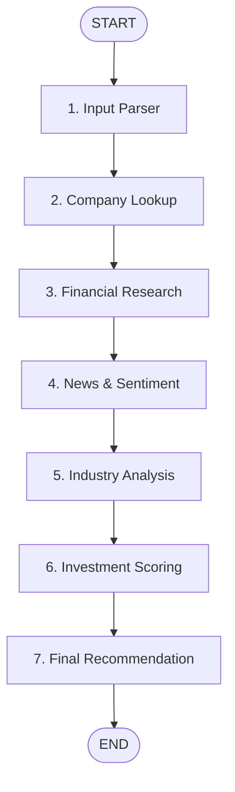

# Stocky — AI Development Log

This document summarizes the AI-assisted development process and key engineering discussions that occurred while building Stocky. It highlights the architectural decisions, code-evolution, debugging workflows, and lessons learned during the 7-day development lifecycle.

---

## 1. Initial Architecture

### The Context
The task was to build an AI Investment Research Agent using React/Next.js for the frontend, Node.js for the backend, and LangChain.js/LangGraph.js for the AI workflow orchestration.

### Key Discussions & Decisions
We discussed whether to build a Next.js monorepo or keep the frontend and backend decoupled. We decided to build a **decoupled architecture**:
* **Frontend:** React (Vite) + TypeScript for speed, rapid HMR, and clean production builds.
* **Backend:** Express + TypeScript to serve as the API hosting our LangGraph workflow.
* **Communication:** Standard REST API (`POST /api/analyze` and `GET /api/search`).

By separating the client and server codebases, we simplified Vercel frontend deployments and decoupled hosting configurations on Render/Railway.

---

## 2. LangGraph Workflow

### The Context
Rather than executing a single, massive LLM prompt to research and decide on an investment, the application mandated a structured agent workflow.

### Key Discussions & Decisions
We mapped out a **7-node sequential graph** to isolate concerns and prevent token context inflation.



* **State Isolation:** Each node reads only from a typed `InvestmentState` annotation and returns partial state overrides.
* **Modularity:** Isolating news fetching from financial statement lookups allowed us to implement granular try/catch blocks so that if news fails, the financial calculations still run.

---

## 3. Deterministic Scoring

### The Context
How do we grade a stock? Letting an LLM guess a score based on raw text is a "black box" that results in inconsistent, non-explainable scores.

### Key Discussions & Decisions
We implemented a **hybrid scoring mechanism**:
* **Quantitative (60%):** Calculated through strict TypeScript algorithms. For instance, P/E multiples, debt-to-equity leverage, and YoY revenue growth are parsed and assigned points based on mathematical thresholds.
* **Qualitative (40%):** The LLM assesses moats, competitive positions, and news risks, mapping them to normalized 0-20 scores.
* **Verdict Alignment:** The final decision (BUY/HOLD/SELL) is mapped directly from the cumulative score. The LLM cannot override mathematical metrics.

---

## 4. Financial APIs

### The Context
We needed reliable company profile, balance sheet, and news endpoints.

### Key Discussions & Decisions
* **API Integration:** Integrated **Financial Modeling Prep (FMP)** as our core financial data provider.
* **Fallback Layer:** Set up **Finnhub** as a fallback API for search queries, profiles, and company news to ensure high availability.
* **Caching Layer:** Implemented an in-memory TTL cache (`server/src/services/cache.ts`) to cache profile and financial responses for 24 hours. This reduces external API calls and keeps operations within free-tier quotas.

---

## 5. LLM Provider Migration (Gemini → OpenRouter)

### The Context
Initially, the backend was configured to use the Gemini API directly. However, we quickly encountered tight Rate-Per-Minute (RPM) and Rate-Per-Day (RPD) limits on the free tier.

### Key Discussions & Decisions
* **The Problem:** Direct `@langchain/google-genai` integration returned frequent `429 Quota Exceeded` errors during iterative testing.
* **The Migration:** We migrated the LLM client wrapper in `llm.ts` to utilize the **OpenRouter API** with the free model `google/gemini-2.0-flash-lite:free`. This resolved rate-limiting bottlenecks while maintaining the same performance and output format.
* **JSON Integrity:** Added robust JSON parsing utility functions to strip markdown code fences (` ```json `) and sanitize incoming strings before running `JSON.parse`.

---

## 6. UI Refinement

### The Context
Our initial landing page and dashboard layout felt cramped, lacked visual separation, and contained several design issues.

### Key Discussions & Decisions
* **Tab-to-Scroll Migration:** Replaced the initial tabbed interface with a clean, unified scrolling dashboard report.
* **Visual Proportions:** Moved the **Financials card** directly to the sidebar underneath the **Score Gauge**, placing it adjacent to the **Thesis / Recommendation** card to create a balanced layout.
* **Gauge Scaling:** Reduced the circular SVG `ScoreGauge` size from `w-40 h-40` to `w-28 h-28` to maintain proportion inside the card.
* **CSS Cleanup:** Replaced the unused, un-compiled `glass-card` classes with Tailwind-defined tokens (`bg-bg-card border border-border rounded-2xl`).

---

## 7. Production Readiness

### The Context
Transitioning to deployment required silencing debug logs, eliminating unused code, and securing cross-domain communication.

### Key Discussions & Decisions
* **Centralized Logger:** Created `server/src/utils/logger.ts` to silence non-critical execution logs in production (`NODE_ENV === "production"`) while keeping `logger.error` active.
* **Uptime Keep-Alive Route:** Created a direct `GET /ping` route that immediately returns `"pong"` without starting LLM pipelines. This enables third-party keep-alive checks to prevent Render/Railway server sleep cycles.
* **Vercel API URLs:** Updated the client API layer to fetch from `import.meta.env.VITE_API_URL`, supporting CORS deployments.

---

## 8. Documentation

### The Context
Preparing the project for evaluation by Altuni AI Labs reviewers.

### Key Discussions & Decisions
* Rebuilt the main `README.md` to cleanly outline the architecture, mathematical scoring rules, prompt structure, challenges, and setup instructions.
* Excluded internal LaTeX layout scripts and raw prompt text walls to ensure clean readability.
* Added screenshot placeholders and live links.

---

## 9. Lessons Learned

1. **Decouple Math from GenAI:** Utilizing deterministic rules to compute scores, while leaving context-building and synthesis to the LLM, delivers highly reliable results.
2. **Design for API Constraints:** Layering caches and fallback APIs is essential when building prototypes on free-tier rate limits.
3. **Structured Outputs are Fragile:** Even with strict JSON prompt guidelines, LLMs occasionally return markdown enclosures. Sanitation utilities (strippers and brackets extractors) must always wrap JSON parser inputs.
